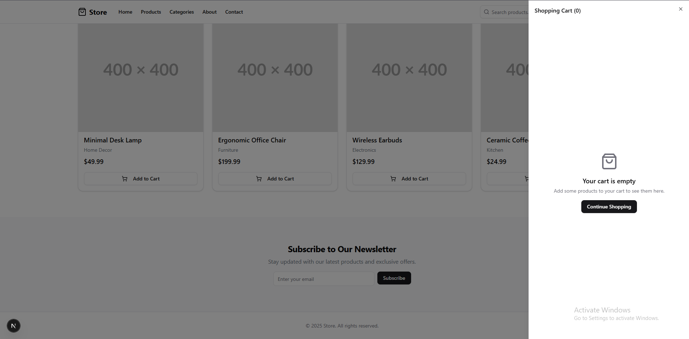
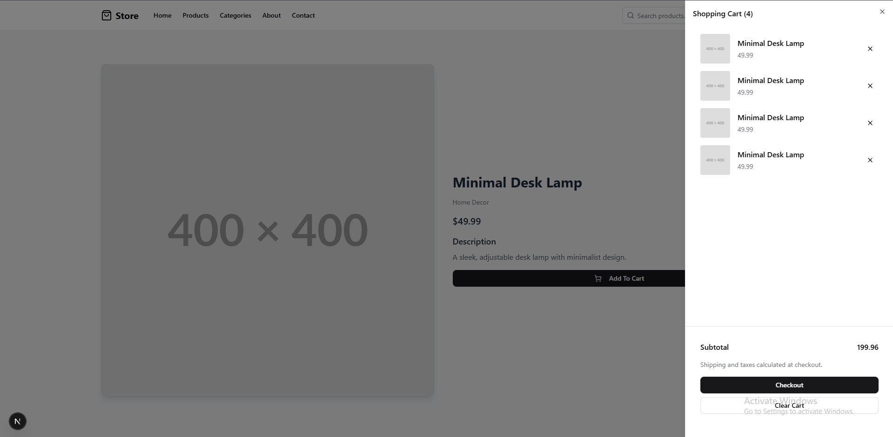
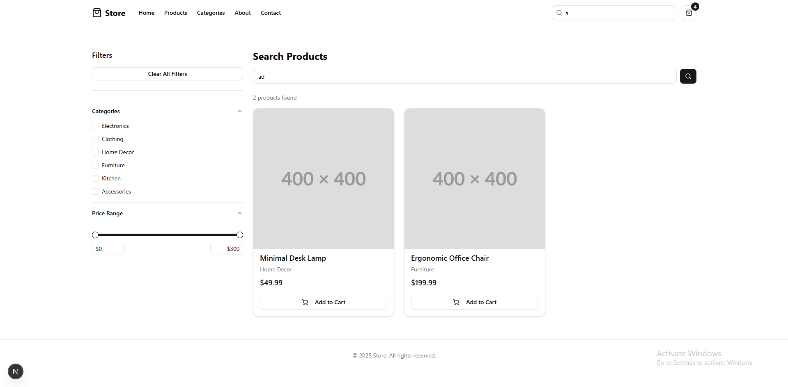

# Modern E-Commerce Store

A clean, modern e-commerce website built with Next.js, Tailwind CSS, and shadcn/ui components. This project features a minimalist design focused on user experience and performance.

## 🎯 Screens

### Cart:



### Product Page With Cart:



### Search Page:



## 🚀 Features

### Core Functionality
- **Product Catalog**: Browse products with detailed information and images
- **Advanced Search**: Full-text search with filtering by category and price range
- **Shopping Cart**: Add/remove items with persistent storage using localStorage
- **Checkout Flow**: Multi-step checkout process with shipping and payment forms
- **Responsive Design**: Optimized for mobile, tablet, and desktop devices

### User Interface
- **Clean Design**: Minimalist aesthetic with focus on product presentation
- **shadcn/ui Components**: Consistent, accessible UI components
- **Mobile-First**: Responsive design that works seamlessly across all devices
- **Loading States**: Smooth transitions and loading indicators

### Technical Features
- **Next.js App Router**: Modern routing with file-based navigation
- **TypeScript**: Full type safety throughout the application
- **Form Validation**: Robust form handling with React Hook Form and Zod
- **State Management**: React Context for cart management
- **Performance Optimized**: Image optimization and efficient rendering

## 🛠️ Tech Stack

- **Framework**: [Next.js 15](https://nextjs.org/) with App Router
- **Styling**: [Tailwind CSS](https://tailwindcss.com/)
- **UI Components**: [shadcn/ui](https://ui.shadcn.com/)
- **Icons**: [Lucide React](https://lucide.dev/)
- **Language**: [TypeScript](https://www.typescriptlang.org/)

## 📦 Installation

### Prerequisites
- Node.js 18+ 
- npm, yarn, or pnpm

### Setup Instructions

1. **Clone or download the project**
   ```bash
   # If using git
   git clone https://github.com/Mo-Ibra/nextjs-clean-ecommerce
   cd nextjs-clean-ecommerce
   ```

2. **Install dependencies**
   ```bash
   npm install
   # or
   yarn install
   # or
   pnpm install
   ```

3. **Run the development server**
   ```bash
   npm run dev
   # or
   yarn dev
   # or
   pnpm dev
   ```

4. **Open your browser**
   Navigate to [http://localhost:3000](http://localhost:3000) to see the application.

## 🎯 Key Pages

### Homepage (`/`)
- Hero section with call-to-action
- Featured product showcase
- Category navigation
- Newsletter signup

### Products (`/products`)
- Complete product listing
- Product cards with images and pricing
- Links to individual product pages

### Product Detail (`/products/[id]`)
- Detailed product information
- High-quality product images
- Add to cart functionality
- Product specifications

### Search (`/search`)
- Advanced search functionality
- Category and price filtering
- Real-time results
- Mobile-friendly filter panel

### Checkout (Coming Soon) (`/checkout`)
- Multi-step checkout process
- Shipping information form
- Payment method selection
- Order confirmation

## 🛒 Cart Management

The shopping cart uses React Context for state management and localStorage for persistence:

- **Add to Cart**: Products can be added from product cards or detail pages
- **Remove Items**: Individual items can be removed from the cart
- **Persistent Storage**: Cart contents are saved between browser sessions
- **Real-time Updates**: Cart count updates immediately when items are added/removed

## 🔍 Search & Filtering

Advanced search functionality includes:

- **Text Search**: Search across product names and descriptions
- **Category Filtering**: Filter by product categories
- **Price Range**: Adjustable price range slider
- **Real-time Results**: Instant filtering as criteria change
- **Mobile Optimization**: Collapsible filter panel for mobile devices

## 📱 Responsive Design

The application is fully responsive with:

- **Mobile-First Approach**: Designed for mobile devices first
- **Breakpoint System**: Tailwind CSS responsive utilities
- **Touch-Friendly**: Optimized for touch interactions
- **Performance**: Optimized images and efficient rendering

## 🎨 Customization

### Styling
- Update `app/globals.css` for global styles
- shadcn/ui components can be customized in `components/ui/`

### Data
- Product data is stored in `lib/data.ts`
- Add new products by extending the products array
- Categories can be modified in the same file

### Components
- All components are modular and reusable
- Located in `components/` directory
- Follow TypeScript interfaces defined in `lib/types.ts`

## 🚀 Deployment

### Vercel (Recommended)
1. Push your code to a Git repository
2. Connect your repository to [Vercel](https://vercel.com)
3. Deploy with zero configuration

### Other Platforms
The application can be deployed to any platform that supports Next.js:
- Netlify
- AWS Amplify
- Railway
- DigitalOcean App Platform

## 🔧 Environment Variables

Currently, the application doesn't require environment variables for basic functionality. For production deployments, you may want to add:

```env
# Example environment variables
NEXT_PUBLIC_SITE_URL=https://yourstore.com
NEXT_PUBLIC_ANALYTICS_ID=your-analytics-id
```

## 📈 Performance Optimization

The application includes several performance optimizations:

- **Next.js Image Optimization**: Automatic image optimization and lazy loading
- **Code Splitting**: Automatic code splitting with Next.js
- **Static Generation**: Static generation for product pages where possible
- **Efficient State Management**: Optimized React Context usage

## 🤝 Contributing

1. Fork the repository
2. Create a feature branch (`git checkout -b feature/amazing-feature`)
3. Commit your changes (`git commit -m 'Add amazing feature'`)
4. Push to the branch (`git push origin feature/amazing-feature`)
5. Open a Pull Request

## 📝 License

This project is open source and available under the [MIT License](LICENSE).

## 🆘 Support

If you encounter any issues or have questions:

1. Check the [Issues](../../issues) section
2. Create a new issue with detailed information
3. Include steps to reproduce any bugs

## 🔮 Future Enhancements

Potential features for future development:

- User authentication and accounts
- Wishlist functionality
- Product reviews and ratings
- Payment gateway integration
- Inventory management
- Order tracking
- Email notifications
- Multi-language support
- Dark mode toggle
- Progressive Web App (PWA) features

## 📊 Browser Support

- Chrome (latest)
- Firefox (latest)
- Safari (latest)
- Edge (latest)
- Mobile browsers (iOS Safari, Chrome Mobile)

---

**Built with ❤️ using Next.js and modern web technologies**